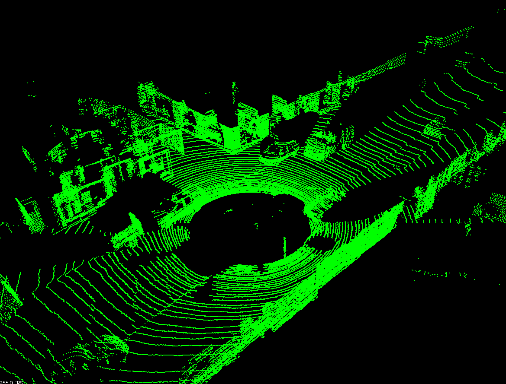
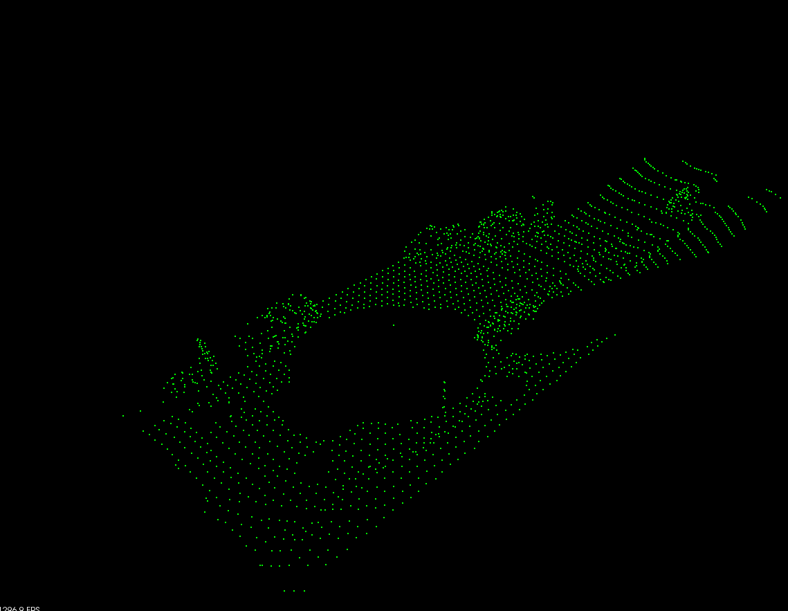
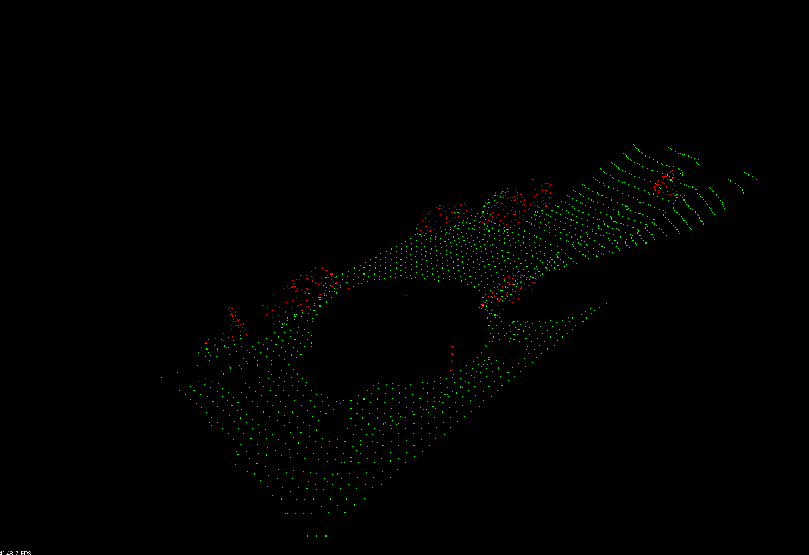
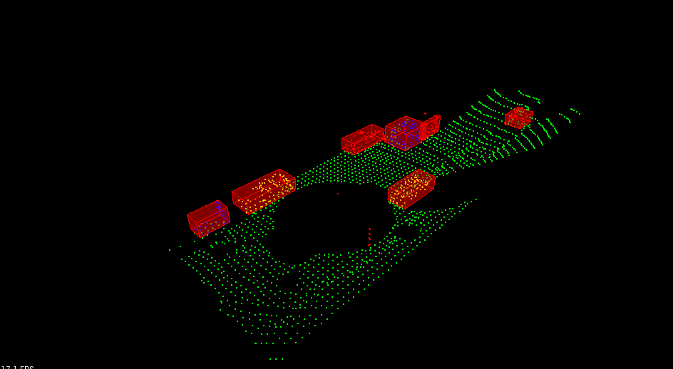

# Sensor Fusion Self-Driving Car Course


# Run on Ubuntu 
```bash
$> sudo apt install libpcl-dev
$> cd ~
$> git clone https://github.com/JZlearnCode/2019_Udacity_Sensor_Fusion.git
$> cd 1_Lidar_Obstacle_Detection
$> mkdir build && cd build
$> cmake ..
$> make
$> ./environment
```

# File structure
```
project
│   README.md
└───src
|   └───src/            Implementation of lidar obstacle detection
|        └───render/    Render and visualize 
|        └───sensors/   Define simulation of lidar sensor  
│        |   environment.cpp    Main function to load point cloud data and run detection
|        |   processPointClouds.cpp/.h   Functions to manipulate point cloud data 
|        |   kdtree.h   Defines KD tree 
└───data 
|   └───pcd_example/*.pcd            Point cloud data     
```
 
# Implementation

## Step 1. Downsample point cloud by voxel grid filtering and region of interest filtering
### Voxel grid filtering
Voxel grid filtering creates a cubic grid and filter the cloud by only
leaving a single point per voxel cube, so the larger the cube length
the lower the resolution of the point cloud.

### Region of interest filtering 
Points too far from the ego vehicle are removed. Also, there are points too close to the lidar and were caused by lidar light bouncing off roof of the car, these need to be removed aswell. 

Before downsample: 


After downsample using voxel grid and region of interest filtering. This process took on average 7 ms per frame.


## Step 2. Remove ground plane using RANSAC
#### Ground removal
Ground and non-ground points can be separated by assuming the ground is a plane,
fit a plane model using RANSAC, and inliers to the plane model will be the ground.

A plane can be defined using 3 points, by solving for A, B, C, D using the 3 points' coordinates.
```
Ax + By + Cz + D = 0
```

If a point's distance to the plane is less than distance tolerance, the point is an inlier.

The distance from a point (x, y, z) to plane `Ax + By + Cz + D` is:

```
distance = abs(A*x + B*y + C*z + D) / sqrt(A^2 + B^2 + C^2)
```

#### RANSAC 
RANSAC stands for Random Sample Consensus, and is a method for detecting outliders in data.
RANSAC runs for a max number of iterations, and returns the model with the best fit.

To fit a plane using RANSAC, each iteration rancomly picks 3 points and fits 
a plane model through it. 
The the iteration with the highest number of inliers is used as the best model. 

RANSAC took 170-200 ms per frame.
Following is a result of ground removal. The green points
are ground points, and the red points
are non-ground points and would be counted as obstacles. 

 
## Step 3. Obstacle detection using KD tree and Euclidean Clustering
#### K-D tree
A K-D tree is a binary search tree where data in each node si a K-dimensional point in
space. In short, it is a space partitioning data structure for organizing points in a K-dimensional space.
K-D tree is used here to store the points in point cloud and search for nearby points. 

#### Euclidean Clustering  
Euclidean clustering can group points into clusters by their proximity to each other in space.

To perform the clusering, iterate through each point in the cloud and keep track of
which points have been processed already. For each point that's not been processed yet, 
use it as the first point in a new cluster. Then get a list of neighbors to the point 
which is already in the cluster, add the neighbors to the cluster and recursively
repeat the process. 

Speed of Euclidean clustering using KD tree: 10 ms per frame.  

Following is a result of Euclidean clustering.  

 

