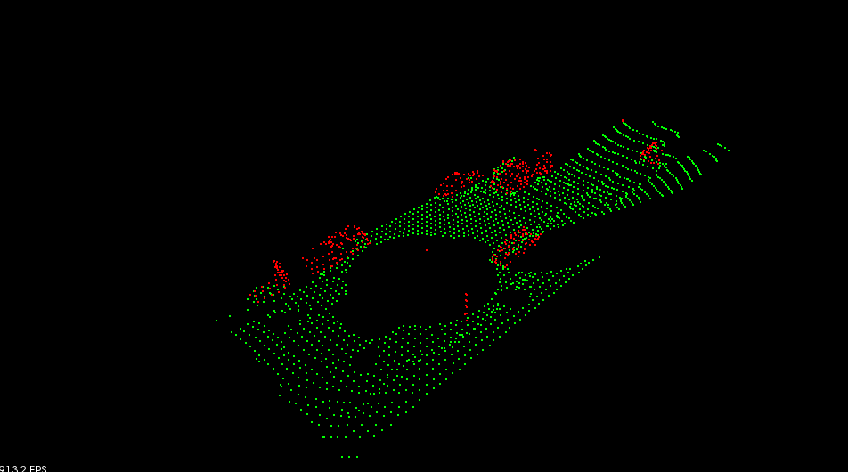

# Sensor Fusion Self-Driving Car Course


# Run on Ubuntu 
```bash
$> sudo apt install libpcl-dev
$> cd ~
$> git clone https://github.com/JZlearnCode/2019_Udacity_Sensor_Fusion.git
$> cd 1_Lidar_Obstacle_Detection
$> mkdir build && cd build
$> cmake ..
$> make
$> ./environment
```
# Implementation

## Step 1. Downsample point cloud by voxel grid filtering and region of interest filtering
### Voxel grid filtering
Voxel grid filtering creates a cubic grid and filter the cloud by only
leaving a single point per voxel cube, so the larger the cube length
the lower the resolution of the point cloud.

### Region of interest filtering 
Points too far from the ego vehicle are removed. Also, there are points too close to the lidar and were caused by lidar light bouncing off roof of the car, these need to be removed aswell. 

Before downsample: 


After downsample using voxel grid and region of interest filtering. This process took on average 7 ms per frame.


## Step 2. Remove ground plane using RANSAC
#### Ground removal

#### RANSAC 
RANSAC took 170-200 ms per frame.
Following is a result of ground removal. The green points
are ground points, and the red points
are non-ground points and would be counted as obstacles. 


 
## Step 3. Obstacle detection using KD tree and Euclidean Clustering
#### KD tree

#### Euclidean Clustering  

Speed of Euclidean clustering using KD tree: 10 ms per frame.  

Following is a result of Euclidean clustering.  


# File structure
```
project
│   README.md
└───src
|   └───src/            Implementation of lidar obstacle detection
|        └───render/    Render and visualize 
|        └───sensors/   Define simulation of lidar sensor  
│        |   environment.cpp    Main function to load point cloud data and run detection
|        |   processPointClouds.cpp/.h   Functions to manipulate point cloud data 
└───data 
|   └───pcd_example/*.pcd            Point cloud data     
```

 

