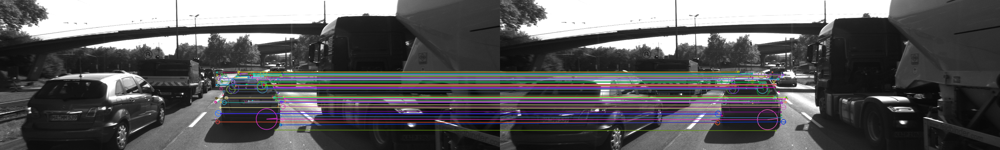

# SFND 2D Feature Tracking
This project tests various detector / descriptor combinations to see which ones perform best
in matching features from 2D camera image in order to track vehicle across
consecutive frames.

## Environment settings
* Ubuntu 18  
* OpenCV >= 4.1
  * Compiled from source using the `-D OPENCV_ENABLE_NONFREE=ON` cmake flag for the SIFT and SURF detectors.
 
## Basic Build Instructions
1. Clone this repo.
2. `mkdir build && cd build`
3. Compile: `cmake .. && make`
4. Run it: `./2D_feature_tracking`.

# Implementation
## Steps
#### S1. Detect feature points
Feature points are detected, filtered by limiting the keypoints within the 
bounding box of preceding vehicle.    
Algorithms include HARRIS, FAST, BRISK, ORB, AKAZE, and SIFT.
#### S2. Feature descriptor
Use one of several types of state-of-art descriptors to uniquely identify
keypoints: BRIEF, ORB, FREAK, AKAZE, SIFT.
#### S3. Match key points
Find best matches for keypoints in two camera images using Brute Force with descriptor distance ratio set to 0.8. 

# Result 
Different combinations of detectors and descriptors are evaluated by how many points
are detected, matched and how much time was used.

The top 3 detector descriptor combinations are:
1) The pair took least time:      HARRIS detector + BREIF descriptor 
2) The pair creates most matches: FAST detector   + ORB   descriptor 
3) The pair took most time but have reputation for good accuracy:  SIFT detector + SIFT descriptor 

Following is an image of SIFT detector + SIFT descriptor result:

| Detector  |Detector time (ms)|Num keypoints detected| Descriptor | Descriptor time (ms)|Num Matches  | 
| ----------|------------------|----------------------|------------|---------------------|-------------|
| SHITOMASI | 38               | 117                  |  BRIEF     | 0.84                | 104         |               
| SHITOMASI |                  |                      |  ORB       | 1.03                | 101         |               
| SHITOMASI |                  |                      |  FREAK     | 39                  | 85          |               
| SHITOMASI |                  |                      |  SIFT      | 15                  | 103         |               
| HARRIS    | 34               | 127                  |  BRIEF     | 0.62                | 47          |               
| HARRIS    |                  |                      |  ORB       | 0.98                | 46          |               
| HARRIS    |                  |                      |  FREAK     | 40                  | 49          |               
| HARRIS    |                  |                      |  SIFT      | 14                  | 47          |              
| FAST      | 358              | 408                  |  BRIEF     | 1.81                | 315         |               
| FAST      |                  |                      |  ORB       | 1.63                | 308         |               
| FAST      |                  |                      |  FREAK     | 42                  | 248         |               
| FAST      |                  |                      |  SIFT      | 30                  | 309         |              
| BRISK     | 471              | 278                  |  BRIEF     | 1.24                | 189         |               
| BRISK     |                  |                      |  ORB       | 4                   | 168         |               
| BRISK     |                  |                      |  FREAK     | 42                  | 169         |               
| BRISK     |                  |                      |  SIFT      | 40                  | 183         |
| ORB       | 10               | 118                  |  BRIEF     | 0.58                | 61          |               
| ORB       |                  |                      |  ORB       | 4                   | 85          |               
| ORB       |                  |                      |  FREAK     | 40                  | 47          |               
| ORB       |                  |                      |  SIFT      | 46                  | 85          |
| AKAZE     | 93               | 167                  |  AKAZE     | 60                  | 139         |
| SIFT      | 155              | 138                  |  BRIEF     | 1.37                | 78          |               
| SIFT      |                  |                      |  ORB       | Out of Memory                     |               
| SIFT      |                  |                      |  FREAK     | 43                  | 66          |               
| SIFT      |                  |                      |  SIFT      | 82                  | 89          |

Additional note for the table: 

1)AKAZE detector only work with AKAZE descriptor 

2)To make the table not look too crowded, the time only shows 2 digits after decimal point if the value is less than 2 ms

3)SHITOMASI used block size 4, HARRIS used block size 2 

