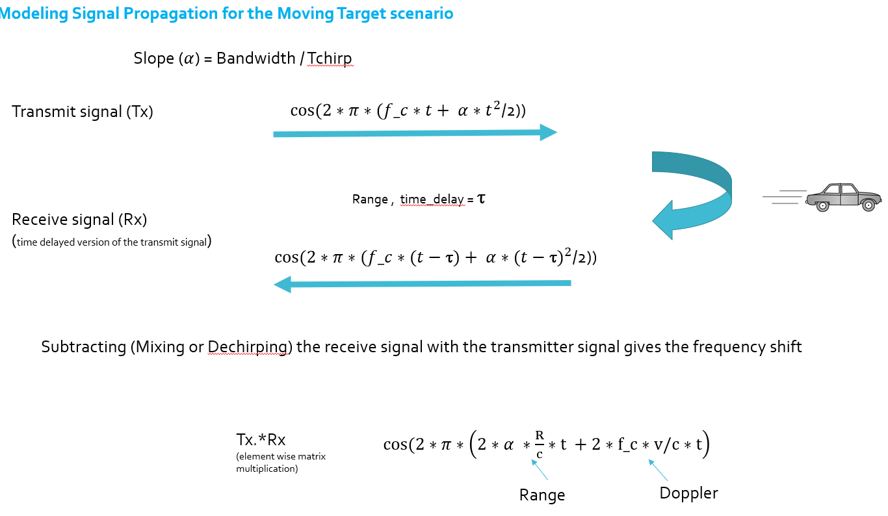
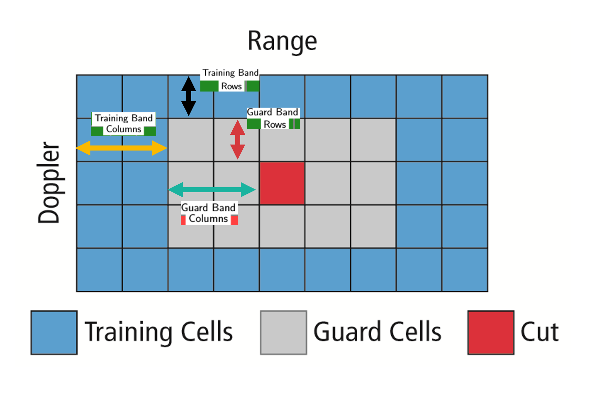

# Summary
This project configures FMCW waveform, calculates beat frequency and perform 2nd FFT on the beat signal to obtain a range doppler map. CFAR is applied to the range doppler map to display the target. 

The project contains following parts:

1. Configure the FMCW waveform based on the system requirements.
2. Define the range and velocity of target and simulate its displacement.
3. For the same simulation loop process the transmit and receive signal to determine the beat signal
4. Perform Range FFT on the received signal to determine the Range
Towards the end, perform the CFAR processing on the output of 2nd FFT to display the target.

# Implementation
## Radar Sepecifications
System Requirements defines the design of a Radar. The sensor fusion design for different driving scenarios requires different system configurations from a Radar.  
Follwoing are specifications to configure the FMCW waveform based on the system requirements.

| Parameter          |  Value         |  
| -------------------|----------------| 
| Frequency          |  77 GHz        |
| Range Resolution   |  200 m         |
| Max velocity       |  70 m/s        |
| Velocity resolution|  3 m/s         |

Max Range and Range Resolution will be considered here for waveform design.

The sweep bandwidth can be determined according to the range resolution and the sweep slope is calculated using both sweep bandwidth and sweep time.

Slope of the chirp was calculated in the project. With the given parameters, the slope
was 2e13.

## Beat signal
For the same simulation, the transmit and receive signal are used for determining the beat signal.

When two sound waves of different frequency approach your ear, the alternating constructive and destructive interference causes the sound to be alternatively soft and loud - a phenomenon which is called "beating" or producing beats. The beat frequency is equal to the absolute value of the difference in frequency of the two waves.

## 1D FFT 
Fast Fourier Transform (FTT) was performed on the received signal to determine the Range

The Fourier Transform is a mathematical technique that transforms a function of time, x(t), to a function of frequency, X(ω). 

Following is the 1D FFT result. 

## 2D FFT
A 2D FFT was run on the mixed signal (beat signal). The output was a range doppler map.

Once the range bins are determined by running range FFT across all the chirps, a second FFT is implemented along the second dimension to determine the doppler frequency shift.

Following is the 2D FFT result. 

## CFAR

The CFAR process includes the sliding of a window across the cells in FFT blocks. Each window consists of the following cells.

`Cell Under Test` : The cell that is tested to detect the presence of the target by comparing the signal level against the noise estimate (threshold).

`Training Cells` : The level of noise is measured over the Training Cells. The number of training cells should be decided based on the environment. If a dense traffic scenario then the fewer training cells should be used, as closely spaced targets can impact the noise estimate.

`Guard Cells` : The cells just next to CUT are assigned as Guard Cells. The purpose of the Guard Cells is to avoid the target signal from leaking into the training cells that could adversely affect the noise estimate. The number of guard cells should be decided based on the leakage of the target signal out of the cell under test. If target reflections are strong they often get into surrounding bins.

`Threshold Factor (Offset)` : Use an offset value to scale the noise threshold. If the signal strength is defined in logarithmic form then add this offset value to the average noise estimate, else multiply it.

In the project implementation, following are the parameters used for CFAR:

| Parameter                                  |  Value     |  
| -------------------------------------------|------------| 
| Training Cells for range dimesion (Tr)     |  12        |
| Training Cells for doppler dimesion (Td)   |  3         |
| Guardian Cells for range dimesion (Gr)     |  4         |
| Guardian Cells for doppler dimesion (Gd)   |  1         |

Implementation steps for the 2D CFAR process:
1. Slide the Cell Under Test (CUT) across the complete cell matrix
2. Measure and average the noise across all the training cells centered around CUT. This gives the threshold
Add the offset (if in signal strength in dB) to the threshold to keep the false alarm to the minimum.
3. If the CUT signal level is greater than the Threshold, assign a value of 1, else equate it to zero.
4. Since the cell under test are not located at the edges, due to the training cells occupying the edges, we suppress the edges to zero. Any cell value that is neither 1 nor a 0, assign it a zero.

Following is the CFAR result.

