# Motion Model
## CVRT
Constant turn rate and velocity magnitude.

### State Vector 
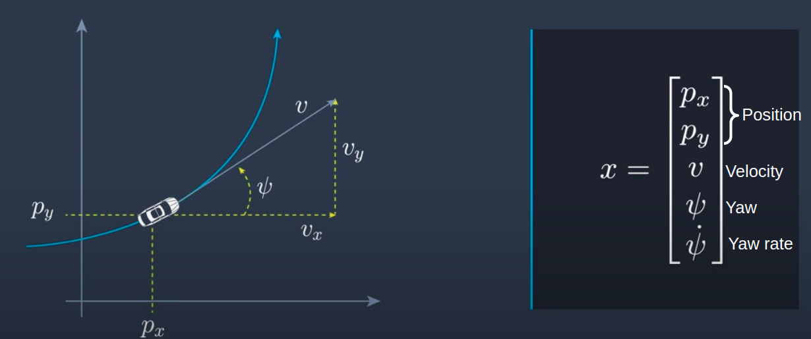

### Process Model 
Deterministic part: 

State vector at time `t+1` can be estimated using state at time `t` based on CVRT model. 
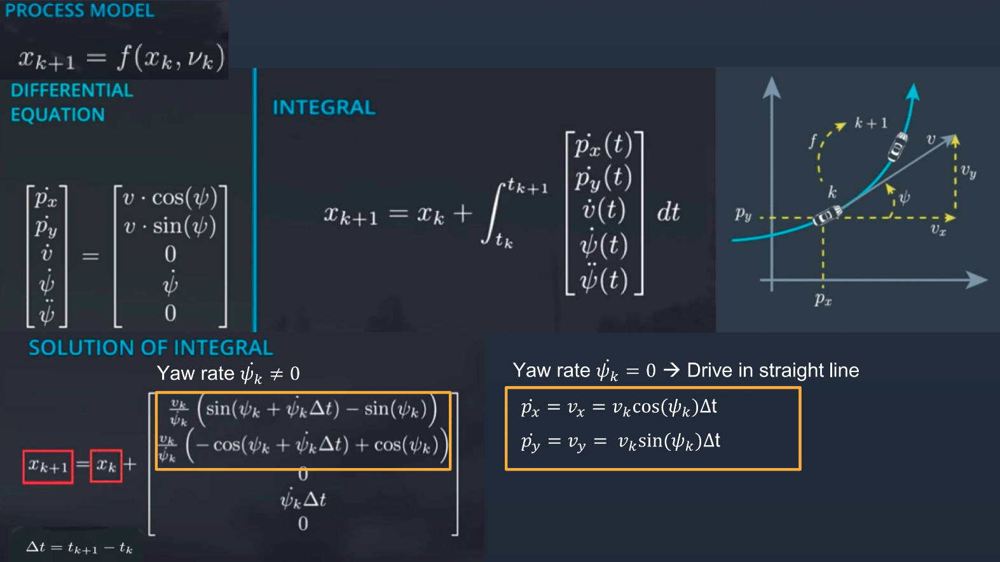

Stochasitic part: 

Process Noise contains logitudinal acceleration noise and yaw acceleration noise, both are Gaussian distribution with zero mean. 
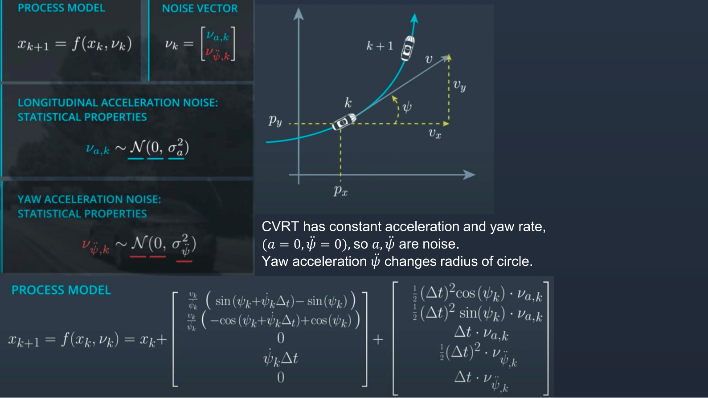

# Radar Measurement


 
# Unscented Kalman Filter 
## Prediction Step 
Prediction step uses state mean and state covariance at timestep `k` to predict state mean and state covariance at timestep `k+1`. 

Here `k|k` means estimation for timestep `k` using measurement from timestep `k`. `k+1|k` means estimation for timestep `k+1` using measurement from timestep `k`. 

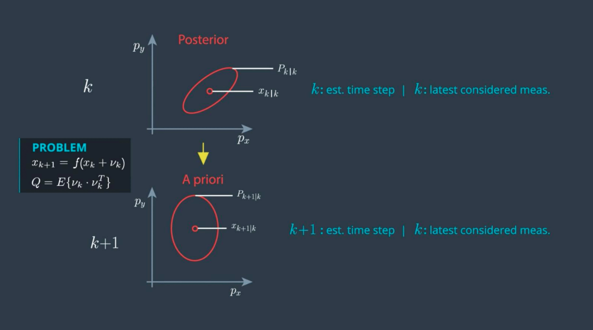

#### S1. Generate Sigma Points
Sigma points consists of 1 point at mean state, then 2 points for each state dimension. Here
λ controls how far the sigma point is from mean state. 

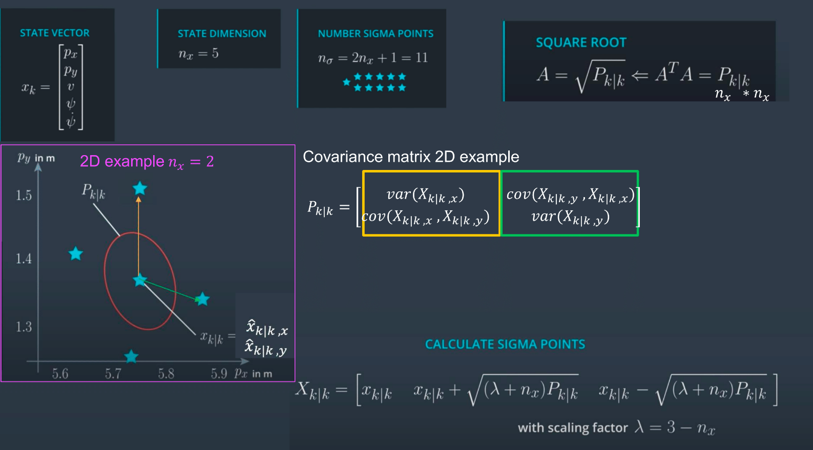

```cpp
void UKF::GenerateSigmaPoints(MatrixXd* Xsig_out) {
  // set state dimension
  int n_x = 5;
  // define spreading parameter
  double lambda = 3 - n_x;
  // state vector 
  VectorXd x = VectorXd(n_x);
  // covariance matrix
  MatrixXd P = MatrixXd(n_x, n_x);
  // create sigma point matrix
  MatrixXd Xsig = MatrixXd(n_x, 2 * n_x + 1);
  // calculate square root of P
  MatrixXd A = P.llt().matrixL();
  // set first column of sigma point matrix
  Xsig.col(0) = x;
  // set remaining sigma points
  for (int i = 0; i < n_x; ++i) {
    Xsig.col(i+1)     = x + sqrt(lambda+n_x) * A.col(i);
    Xsig.col(i+1+n_x) = x - sqrt(lambda+n_x) * A.col(i);
  }
  *Xsig_out = Xsig;
}
```

Since process noise has a nonlinear effect on state, augmented sigma points is used. 

Augmented state consists of state vector and noise vector. The additional sigma points represents the uncertainty caused by the process noise. 

Matrix Q contains the variances of the process noise, the zeros is due to independence between longitudinal and yaw acceleration noise.

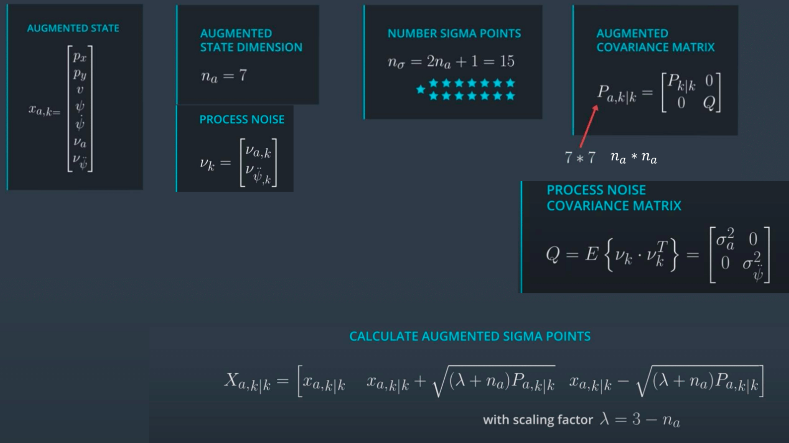

```cpp
void UKF::AugmentedSigmaPoints(MatrixXd* Xsig_out) {
  // set state dimension
  int n_x = 5;
  // set augmented dimension
  int n_aug = 7;
  // Process noise standard deviation longitudinal acceleration in m/s^2
  double std_a = 0.2;
  // Process noise standard deviation yaw acceleration in rad/s^2
  double std_yawdd = 0.2;
  // define spreading parameter
  double lambda = 3 - n_aug;
  // set example state
  VectorXd x = VectorXd(n_x);
  // create example covariance matrix
  MatrixXd P = MatrixXd(n_x, n_x);
  // create augmented mean vector
  VectorXd x_aug = VectorXd(7);
  // create augmented state covariance
  MatrixXd P_aug = MatrixXd(7, 7);
  // create sigma point matrix
  MatrixXd Xsig_aug = MatrixXd(n_aug, 2 * n_aug + 1);
  // create augmented mean state (first n_x elements)
  x_aug.head(5) = x;
  x_aug(5) = 0;
  x_aug(6) = 0;

  // create augmented covariance matrix
  P_aug.fill(0.0);
  P_aug.topLeftCorner(5,5) = P;
  P_aug(5,5) = std_a*std_a;
  P_aug(6,6) = std_yawdd*std_yawdd;
  // create square root matrix
  MatrixXd L = P_aug.llt().matrixL();

  // create augmented sigma points
  Xsig_aug.col(0)  = x_aug;
  for (int i = 0; i< n_aug; ++i) {
    Xsig_aug.col(i+1)       = x_aug + sqrt(lambda+n_aug) * L.col(i);
    Xsig_aug.col(i+1+n_aug) = x_aug - sqrt(lambda+n_aug) * L.col(i);
  }

  // write result
  *Xsig_out = Xsig_aug;
}
```

#### S2. Predict Sigma Points

Each sigma point representing augmented state vector from timestep `t` is processed using CVRT model 
to obtain sigma point for timestep `t`. 

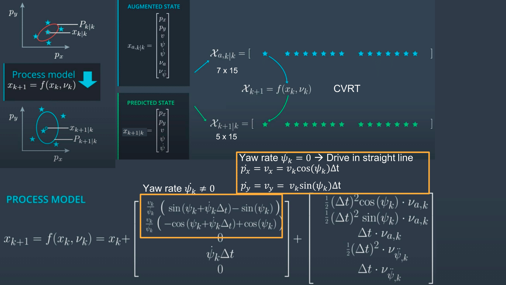

```cpp
void UKF::SigmaPointPrediction(MatrixXd* Xsig_out) {
  int n_x = 5;
  int n_aug = 7;
  // create example sigma point matrix
  MatrixXd Xsig_aug = MatrixXd(n_aug, 2 * n_aug + 1);
  // create matrix with predicted sigma points as columns
  MatrixXd Xsig_pred = MatrixXd(n_x, 2 * n_aug + 1);
  // time diff in sec
  double delta_t = 0.1;  
  // predict sigma points using CVRT model 
  for (int i = 0; i< 2*n_aug+1; ++i) {
    // extract values for better readability
    double p_x = Xsig_aug(0,i);
    double p_y = Xsig_aug(1,i);
    double v = Xsig_aug(2,i);
    double yaw = Xsig_aug(3,i);
    double yawd = Xsig_aug(4,i);
    double nu_a = Xsig_aug(5,i);
    double nu_yawdd = Xsig_aug(6,i);

    // predicted state values
    double px_p, py_p;

    // avoid division by zero
    if (fabs(yawd) > 0.001) {
        px_p = p_x + v/yawd * ( sin (yaw + yawd*delta_t) - sin(yaw));
        py_p = p_y + v/yawd * ( cos(yaw) - cos(yaw+yawd*delta_t) );
    } else {
        px_p = p_x + v*delta_t*cos(yaw);
        py_p = p_y + v*delta_t*sin(yaw);
    }

    double v_p = v;
    double yaw_p = yaw + yawd*delta_t;
    double yawd_p = yawd;

    // add noise
    Xsig_pred(0,i) = px_p + 0.5*nu_a*delta_t*delta_t * cos(yaw);
    Xsig_pred(1,i) = py_p + 0.5*nu_a*delta_t*delta_t * sin(yaw);
    Xsig_pred(2,i) = v_p + nu_a*delta_t;

    Xsig_pred(3,i) = yaw_p + 0.5*nu_yawdd*delta_t*delta_t;
    Xsig_pred(4,i) = yawd_p + nu_yawdd*delta_t;
  }
  // write result
  *Xsig_out = Xsig_pred;
}
```

#### S3. Predict Mean and Covariance
Calculate mean and covariance matrix of the predicted state using the 
predicted sigma points from S2.

In the formulas below, subscrip `i` indincates `ith` column of the matrix.

Weights is smaller if the spreading parameter `λ` is larger, meaning the sigma points
are further from center. 

In S1, given mean and covariance,
λ is used for generating sigma points. Now in S3, given sigma poinsts, mean
and covariance calculated. 

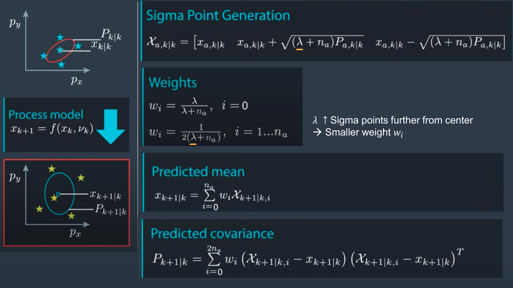

```cpp
void UKF::PredictMeanAndCovariance(VectorXd* x_out, MatrixXd* P_out) {
  int n_x = 5;
  int n_aug = 7;
  // define spreading parameter
  double lambda = 3 - n_aug;
  // create example matrix with predicted sigma points
  MatrixXd Xsig_pred = MatrixXd(n_x, 2 * n_aug + 1);
  // create vector for weights
  VectorXd weights = VectorXd(2*n_aug+1);
  // create vector for predicted state
  VectorXd x = VectorXd(n_x);
  // create covariance matrix for prediction
  MatrixXd P = MatrixXd(n_x, n_x);

  // set weights
  double weight_0 = lambda/(lambda+n_aug);
  weights(0) = weight_0;
  for (int i=1; i<2*n_aug+1; ++i) {  // 2n+1 weights
    double weight = 0.5/(n_aug+lambda);
    weights(i) = weight;
  }

  // predicted state mean
  x.fill(0.0);
  for (int i = 0; i < 2 * n_aug + 1; ++i) {  // iterate over sigma points
    x = x + weights(i) * Xsig_pred.col(i);
  }

  // predicted state covariance matrix
  P.fill(0.0);
  for (int i = 0; i < 2 * n_aug + 1; ++i) {  // iterate over sigma points
    // state difference from predicted mean 
    VectorXd x_diff = Xsig_pred.col(i) - x;
    // angle normalization  [0, 360] --> [-180, 180]
    while (x_diff(3)> M_PI) x_diff(3)-=2.*M_PI;
    while (x_diff(3)<-M_PI) x_diff(3)+=2.*M_PI;

    P = P + weights(i) * x_diff * x_diff.transpose() ;
  }

  // write result
  *x_out = x;
  *P_out = P;
}
```

## Correction Step
#### S4. Predict Measurement
S4 transforms sigma points to measurement state, 
then use them to calculate mean and covariance. 

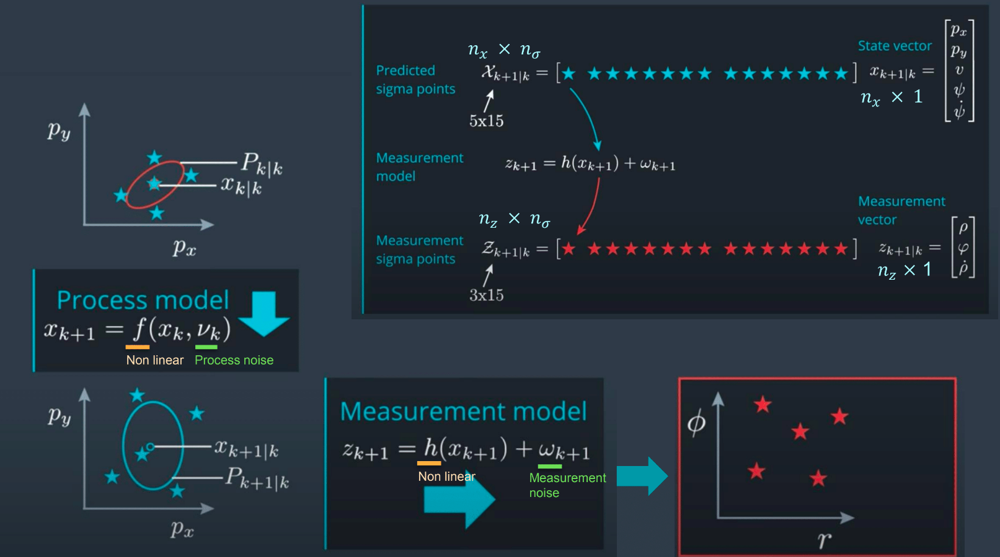

S1 needs augmented state, but S4 doesn't. S1 needs augmentation since 
process noise has non-linear effect on state. S4 doesn't need augmentation
since measurement noise had pure additive effect.

Following is the math in detail. 

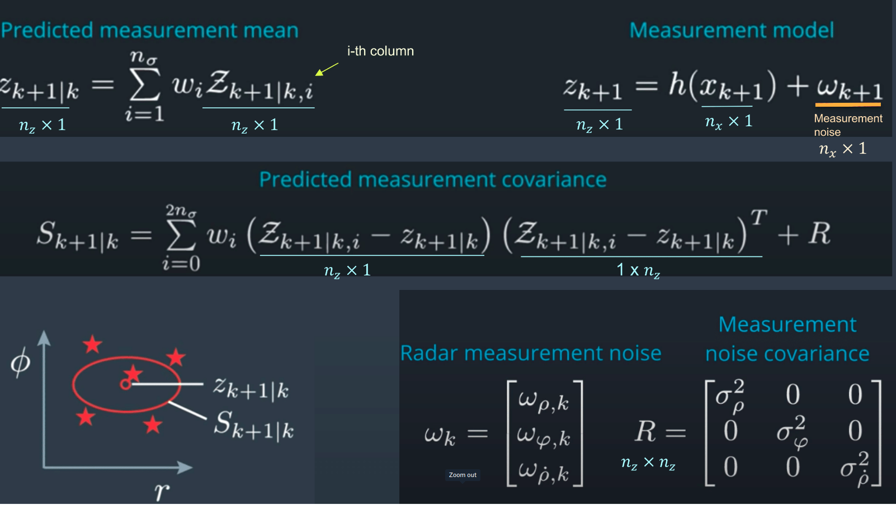


```cpp
void UKF::PredictRadarMeasurement(VectorXd* z_out, MatrixXd* S_out) {
  int n_x = 5;
  int n_aug = 7;
  int n_sig = 2 * n_aug_ + 1;
  // define spreading parameter
  double lambda = 3 - n_aug;
  // set vector for weights
  VectorXd weights = VectorXd(n_sig);
  double weight_0 = lambda/(lambda+n_aug);
  double weight = 0.5/(lambda+n_aug);
  weights(0) = weight_0;

  for (int i=1; i<n_sig; ++i) {  
    weights(i) = weight;
  }

  // set measurement dimension, radar can measure r, phi, and r_dot
  int n_z = 3;
  // radar measurement noise standard deviation radius in m
  double std_radr = 0.3;
  // radar measurement noise standard deviation angle in rad
  double std_radphi = 0.0175;
  // radar measurement noise standard deviation radius change in m/s
  double std_radrd = 0.1;

  // create example matrix with predicted sigma points
  MatrixXd Xsig_pred = MatrixXd(n_x, n_sig);
  // create matrix for sigma points in measurement space
  MatrixXd Zsig = MatrixXd(n_z, n_sig);
  // mean predicted measurement
  VectorXd z_pred = VectorXd(n_z);
  
  // measurement covariance matrix S
  MatrixXd S = MatrixXd(n_z,n_z);

  /**
   * Student part begin
   */

  // transform sigma points into measurement space
  for (int i = 0; i < n_sig; ++i) {  // 2n+1 simga points
    // extract values for better readability
    double p_x = Xsig_pred(0,i);
    double p_y = Xsig_pred(1,i);
    double v  = Xsig_pred(2,i);
    double yaw = Xsig_pred(3,i);

    double v1 = cos(yaw)*v;
    double v2 = sin(yaw)*v;

    // measurement model
    Zsig(0,i) = sqrt(p_x*p_x + p_y*p_y);                       // r
    Zsig(1,i) = atan2(p_y,p_x);                                // phi
    Zsig(2,i) = (p_x*v1 + p_y*v2) / sqrt(p_x*p_x + p_y*p_y);   // r_dot
  }

  // predicted measurement mean
  z_pred.fill(0.0);
  for (int i=0; i < n_sig; ++i) {
    z_pred = z_pred + weights(i) * Zsig.col(i);
  }

  // predicted measurement covariance S
  S.fill(0.0);
  for (int i = 0; i < n_sig; ++i) {  // 2n+1 simga points
    // residual
    VectorXd z_diff = Zsig.col(i) - z_pred;

    // angle normalization
    while (z_diff(1)> M_PI) z_diff(1)-=2.*M_PI;
    while (z_diff(1)<-M_PI) z_diff(1)+=2.*M_PI;

    S = S + weights(i) * z_diff * z_diff.transpose();
  }

  // add measurement noise covariance matrix
  MatrixXd R = MatrixXd(n_z,n_z);
  R <<  std_radr*std_radr, 0, 0,
        0, std_radphi*std_radphi, 0,
        0, 0,std_radrd*std_radrd;
  S = S + R;

  // write result
  *z_out = z_pred;
  *S_out = S;
}
```

#### S5. Update State 
Update state mean and covariance for timestep `t+1`.

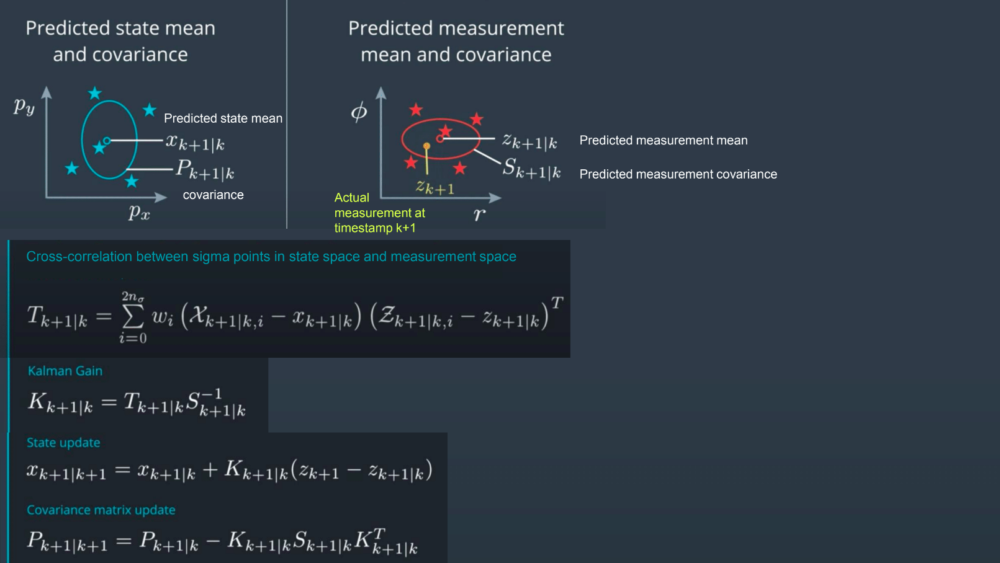

 ```cpp
 void UKF::UpdateState(VectorXd* x_out, MatrixXd* P_out) {
  int n_x = 5;
  int n_aug = 7;
  int n_z = 3;
  double lambda = 3 - n_aug;
  // set vector for weights
  VectorXd weights = VectorXd(2*n_aug+1);
  double weight_0 = lambda/(lambda+n_aug);
  double weight = 0.5/(lambda+n_aug);
  weights(0) = weight_0;

  for (int i=1; i<2*n_aug+1; ++i) {  
    weights(i) = weight;
  }

  // create example matrix with predicted sigma points in state space
  MatrixXd Xsig_pred = MatrixXd(n_x, 2 * n_aug + 1);
  // create example vector for predicted state mean
  VectorXd x = VectorXd(n_x);
  // create example matrix for predicted state covariance
  MatrixXd P = MatrixXd(n_x,n_x);

  // create example matrix with sigma points in measurement space
  MatrixXd Zsig = MatrixXd(n_z, 2 * n_aug + 1);
  // create example vector for mean predicted measurement
  VectorXd z_pred = VectorXd(n_z);

  // create example matrix for predicted measurement covariance
  MatrixXd S = MatrixXd(n_z,n_z);
  
  // create example vector for incoming radar measurement
  VectorXd z = VectorXd(n_z);

  // create matrix for cross correlation Tc
  MatrixXd Tc = MatrixXd(n_x, n_z);

  // calculate cross correlation matrix
  Tc.fill(0.0);
  for (int i = 0; i < 2 * n_aug + 1; ++i) {  // 2n+1 simga points
    // residual
    VectorXd z_diff = Zsig.col(i) - z_pred;
    // angle normalization
    while (z_diff(1)> M_PI) z_diff(1)-=2.*M_PI;
    while (z_diff(1)<-M_PI) z_diff(1)+=2.*M_PI;

    // state difference
    VectorXd x_diff = Xsig_pred.col(i) - x;
    // angle normalization
    while (x_diff(3)> M_PI) x_diff(3)-=2.*M_PI;
    while (x_diff(3)<-M_PI) x_diff(3)+=2.*M_PI;

    Tc = Tc + weights(i) * x_diff * z_diff.transpose();
  }

  // Kalman gain K;
  MatrixXd K = Tc * S.inverse();

  // residual
  VectorXd z_diff = z - z_pred;

  // angle normalization
  while (z_diff(1)> M_PI) z_diff(1)-=2.*M_PI;
  while (z_diff(1)<-M_PI) z_diff(1)+=2.*M_PI;

  // update state mean and covariance matrix
  x = x + K * z_diff;
  P = P - K*S*K.transpose();

  // write result
  *x_out = x;
  *P_out = P;
}
 ```
Note: The materials above is based on Udacity Sensor Fusion online course. 
Many vectors or matrices are not initialized to real world values since 
the code here was to show the algorithm. 

